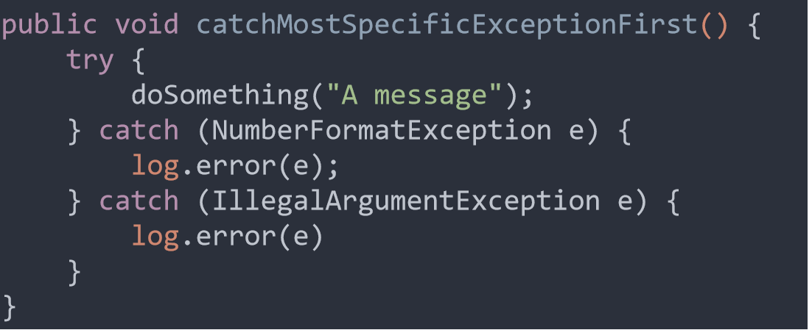
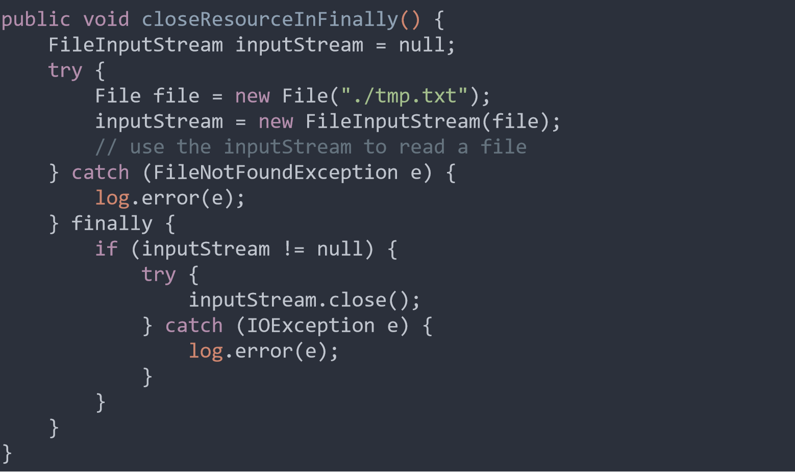
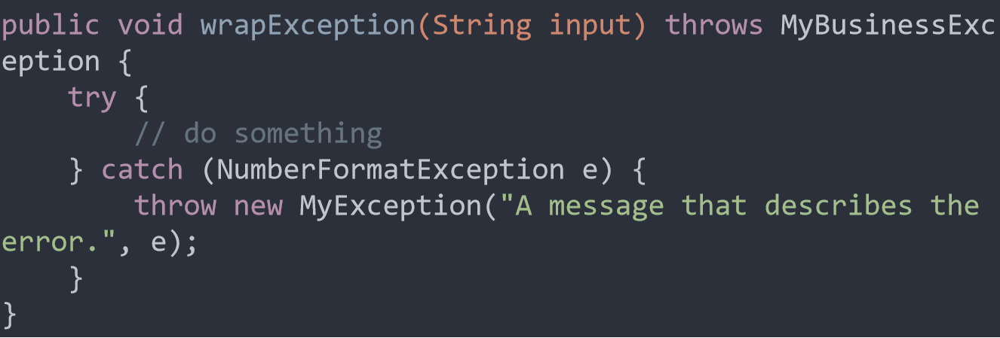
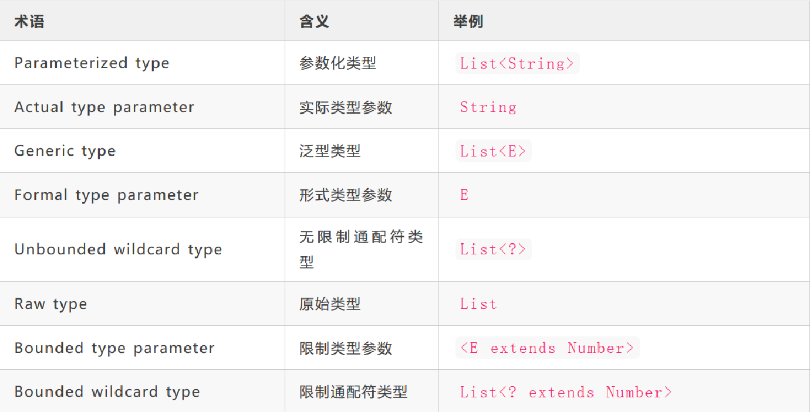
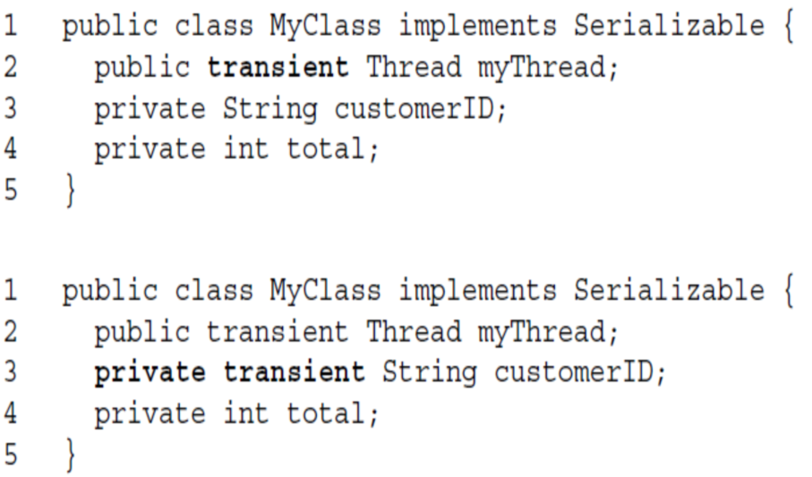
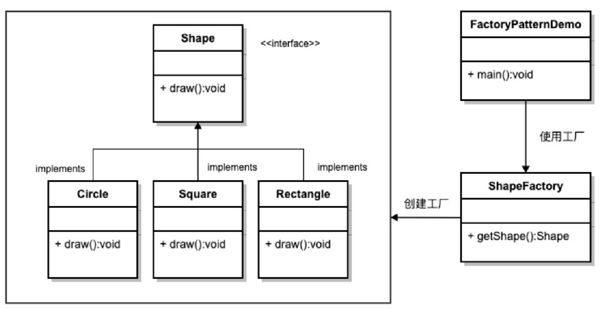

# Java考试笔记

## 1.Java基础

### final

- final 类不能被继承
- final 方法不能被重写
- final 变量是常数
- final 变量只能赋值一次，赋值操作和定义可以分离
- 空白最终变量：即只定义没赋值的变量，空白最终变量可以在构造方法中赋值，空白最终变量要在使用之前赋值

```java
public class Customer {
    private final long customerID;
    public Customer() {
        customerID = createID();
    }
    private long createID() {
        return ... // generate new ID
    }
}
```

### String

```java
String s1 = new String("abc");    
String s2 = "abc";
System.out.println(s1 == s2); //false  
System.out.println(s1.equals(s2)); //true

s1 = "ab" + "c";
s2 = "abc";
System.out.println(s1 == s2); //true
System.out.println(s1.equals(s2)); //true

s1 = "ab";
s2 = "abc";
String s3 = s1 + "c";
System.out.println(s3 == s2); //false 不相等，s1是变量，编译的时候确定不了值，在内存中会创建值，s3在堆内存中，s2在常量池，所以不相等。      
System.out.println(s3.equals(s2)); //true

String s = "hello";
String t = s;
s = "world";
System.out.println(t); // t是"hello"
```

字符串在 Java 中是不可变的，因为 String 对象缓存在 String 池中。

String 是 final 的，因此不可以通过扩展和覆盖行为来破坏 String 类的不变性、缓存、散列值的计算等。

**String作形参、直接赋值（如上文最后一段）**

String类型在Java语言中属于非基本类型，但它在方法中的改变却不会被保存下来，也就是外部变量不会有改变。

String用字符串赋值，引用对象的地址在常量池中；

String用new赋值，或者赋值为“变量+字符串”的形式，引用对象的地址在堆中。

因为String类的存储是通过final修饰的char[]数组来存放结果的。不可更改。所以每次当外部一个String类型的引用传递到方法内部时候，只是把外部String类型变量的引用传递给了方法参数变量。对的。外部String变量和方法参数变量都是实际char[]数组的引用而已。所以当我们在方法内部改变这个参数的引用时候，因为char[]数组不可改变，所以每次新建变量都是新建一个新的String实例。很显然外部String类型变量没有指向新的String实例。所以也就不会获取到新的更改。

**总结string的坑：**

1. 引用地址分为常量池和堆，直接用==很多为false；
2. 并不是简单的引用，改变原对象不会印象赋值对象；
3. 作为形参传递，不会改变原来值。

**StringBuilder、StringBuffer**

String：适用于少量的字符串操作的情况

StringBuilder：适用于单线程下在字符缓冲区进行大量操作的情况（线程不安全）

```java
StringBuilder sb = new StringBuilder(1024);
for (int i = 0; i < 1000; i++) {
    sb.append(',');
    sb.append(i);
}
String s = sb.toString();
```

```java
// 链式操作
public class Main {
    public static void main(String[] args) {
        StringBuilder sb = new StringBuilder(1024);
        sb.append("Mr ")
          .append("Bob")
          .append("!")
          .insert(0, "Hello, ");
        System.out.println(sb.toString());
    }
}
```

StringBuffer：适用多线程下在字符缓冲区进行大量操作的情况（线程安全，但速度慢）。具体操作和StringBuilder一样。

### 包装类,自动装箱/拆箱

自动装箱：基本类型自动转为包装类（int >> Integer）

自动拆箱：包装类自动转为基本类型（Integer >> int）

```java
Integer num1 = 400;  
int num2 = 400;  
System.out.println(num1 == num2);//true

Integer num5 = 100;
Integer num6 = 200;
Long num3 = 300l;
System.out.println(num3 == (num5 + num6));//true
```

在int的的包装类型Integer里面存在这个方法，当Integer大于默认的[-128,127]的时候就会new一个新对象，所以每次的引用地址都不同，所以才会出现不等于，至于这方法存在的原因有的说是对于这个范围内的数字一般使用的比较多，而不需要在常量池中new,直接栈向堆的引用过程。

```java
Integer i1 = 127;
Integer i2 = 127;
Integer i3 = 128;
Integer i4 = 128;

System.out.println(i1==i2); // false
System.out.println(i3==i4); // true
```

Integer、Short、Byte、Character、Long类的valueOf()的实现是类似的,都实现了常量池技术;Double、Float的valueOf()的实现是类似的，没有实现常量池技术。

### 随机数

```java
public class Test {
    public static void main(String[] args) {
        Random rand = new Random();
        System.out.println("rand.nextBoolean():" + rand.nextBoolean());
        // 生成0.0-1.0之间的伪随机double数
        System.out.println("rand.nextDouble():" + rand.nextDouble());
        // 生成0.0-1.0之间的伪随机float数
        System.out.println("rand.nextFloat():" + rand.nextFloat());
        // 生成一个处于int整数取值范围的伪随机数
        System.out.println("rand.nextInt():" + rand.nextInt());
        // 生成0-20之间的伪随机整数 0 <= nextInt(n) < n
        System.out.println("rand.nextInt(20):" + rand.nextInt(20));
        // 生成一个处于long整数取值范围的伪随机数
        System.out.println("rand.nextLong():" + rand.nextLong());
    }
}
```

### 枚举

因为`enum`类型的每个常量在JVM中只有一个唯一实例，所以可以直接用`==`比较。

`enum`定义的类型就是`class`，只不过它有以下几个特点：

- 定义的`enum`类型总是继承自`java.lang.Enum`，且无法被继承；
- 只能定义出`enum`的实例，而无法通过`new`操作符创建`enum`的实例；
- 定义的每个实例都是引用类型的唯一实例；
- 可以将`enum`类型用于`switch`语句。

#### name()

返回常量名，例如：

```
String s = Weekday.SUN.name(); // "SUN"
```

#### ordinal()

返回定义的常量的顺序，从0开始计数，例如：

```
int n = Weekday.MON.ordinal(); // 1
```

改变枚举常量定义的顺序就会导致`ordinal()`返回值发生变化。

#### 构造方法

```java
public class Main {
    public static void main(String[] args) {
        Weekday day = Weekday.SUN;
        if (day.dayValue == 6 || day.dayValue == 0) {
            System.out.println("Work at home!");
        } else {
            System.out.println("Work at office!");
        }
    }
}

enum Weekday {
    MON(1), TUE(2), WED(3), THU(4), FRI(5), SAT(6), SUN(0);

    public final int dayValue;

    private Weekday(int dayValue) {
        this.dayValue = dayValue;
    }
}
```

新增枚举常量时，也需要指定一个`int`值。

#### toString()

默认情况下，对枚举常量调用`toString()`会返回和`name()`一样的字符串。但是，`toString()`可以被覆写，而`name()`则不行。我们可以给`Weekday`添加`toString()`方法。

#### values()、valuesOf()

values()方法的作用就是获取枚举类中的所有变量，并作为数组返回。

valueOf(String name)方法根据名称获取枚举变量。

```java
Day[] days2 = Day.values();
System.out.println("day2:"+Arrays.toString(days2));
Day day = Day.valueOf("MONDAY");
System.out.println("day:"+day);

/**
 输出结果:
 day2:[MONDAY, TUESDAY, WEDNESDAY, THURSDAY, FRIDAY, SATURDAY, SUNDAY]
 day:MONDAY
 */
```

### 补充

数组的强制类型转换：

如果**一开始就声明为Object数组**，那么，即便这个数组中存放的全部是String对象，也是不能转换为String数组！！！

```java
public static void main(String[] args) {
	// 定义集合,添加数据
	ArrayList<Integer> list = new ArrayList<Integer>();
	list.add(100);
	list.add(200);
	list.add(300);
	// Object[] toArray()转换成一个Object数组
	Object[] obj = list.toArray();
	int[] obj2 = (int[])list.toArray();//错误，无法成功转换
	// 遍历数组
	for (int i = 0; i < obj.length; i++) {
		System.out.println(obj[i]);
	}
}
```

```java
//会报异常
Object[] newArray = new Object[] { "AAA", "BBB" };
String[] q = (String[]) (newArray);

//这就没错
Object[] newArray = new String[]{"AAA","BBB"};
String[]q=(String[])(newArray);
```

1. 在java中数组也是类
2. 强制类型转换成功的条件是 ：被强制类型转换的实例需要是强制类型转换类型的类或者其子类
3. 一切类的父类是Object，数组类也不例外
4. Java 数组会记住每个元素的类型， 即创建数组时 new 表达式中使用的元素类型

## 2.继承

子类（subclass）继承父类 superclass (parent class)所有的属性和方法

1. 不继承父类的构造方法
2. 子类不能访问父类声明成private的成员
3. 子类用super()访问父类构造方法

### 对象转换

 **instanceof** 可用来测试一个对象所属的类型

通过对象转换，**获取转化后对象的所有功能**

使用合理的转换原则:

- 子类对象可向父类转换	
- 父类对象向子类转换时，必须经过编译器的验证
- 运行出现错误时，对象类型将被检测

```java
class Employee extends Object {}
class Manager extends Employee {}
class Engineer extends Employee {}
//------------------------------------
public void doSomething(Employee e) {
	if (e instanceof Manager) {
		// Process a Manager
	} else if (e instanceof Engineer) {
		// Process an Engineer
	} else {
		// Process any other type of Employee
	}
}
```

### Object类

- Java所有类都默认继承Object类(java.lang.Object)
- Object类是所有Java类的父类。
- 如果一个类没有声明继承类，则隐式继承Object 类

#### equals()

判断两个对象是否相等

Object类采用==来实现equals()的定义（比较地址）

```java
object1.equals(object2); 
```


#### toString( )

将一个对象转换为字符串
继承后必须被重写

```java
public class Manager extends Employee {
    private String department;

    public Manager(String n, String d) {
        super(n);
        department = d;
    }

    public String toString() {
        return super.toString() + "\nDept: " + department;
    }
}
```

#### 重写

Override 是在继承的时候，如果子类函数与父类函数的函数特征相同，则使用该子类函数时，父类函数被子类函数覆盖掉。

方法的方法名和参数列表，返回类型必须与被重写的方法一致

**访问权限不能低于被它重写的方法**

```java
class Parent {
	public void doSomething() {}
}

class Child extends Parent {
	private void doSomething() {} // 报错，需要改为public
}
```

#### super

在一个类定义中,使用super指向superclass的变量和方法成员 

```java
super.Details
super.getDetails()
```

```java
class Employee {
	public String a;
	protected String b;
	private String c;
	public String getDetails() { return a;}
}
class Manager extends Employee {
	public String getDetails() {return super.getDetails() + super.a + super.b + super.c;} // c会报错
}
```

注意super不能直接调用父类的private属性。

- 引用父类构造方法，必须将 super()放在子类构造方法的第一条语句位置上
- 可以通过super(arguments)调用父类中具有相同参数列表的构造方法
- 在构造方法中如果没有使用 this() 或 super(), 编译器会默认添加一个 super()来调用父类的默认构造方法
- 如果父类中没有一个非私有的默认构造方法，编译器就提示错误

### 抽象类

抽象类可以有没被实现的方法。抽象类除了不能实例化对象之外，类的其它功能依然存在，成员变量、成员方法和构造方法的访问方式和普通类一样。抽象类必须被继承，才能被使用。

```java
public abstract class Vehicle {
    public abstract double calcFuelEfficiency();//注意没有{},但有;
}
public class Truck extends Vehicle {
    public Truck(double max_load) {...}
    public double calcFuelEfficiency() {}
}
public class RiverBarge extends Vehicle {
    public RiverBarge(double max_load) {...}
    public double calcFuelEfficiency() {
        /* calculate the fuel efficiency of a river barge */
    }
}
```

## 接口

**Java的接口可以声明变量和方法，不实现方法体。**

作用：

- 声明一个或多个类要使用的方法
- 为不同的类处理具有相同功能的操作，不用管类之间是否有联系。
- 一个类实施多个接口就等于实现多继承

```java
// 接口是一种特殊的类，由常量和抽象方法组成。
public interface AudioClip { 
    public void play(); //注意语法，和抽象类一样
    public void loop(); 
    public void stop(); 
}

// 接口也有继承性，一个接口可以继承一个以上的父接口。
public interface AudioClipSub extends AudioClip1, AudioClip2{
	...
}
```

接口可以包含以下内容：

1. 静态成员变量；（必须初始化）
2. 抽象方法（未实现的方法）；
3. 静态方法；（只能被接口调用，不能被实现类调用）
4. 默认方法（某种方法的默认实现）。

```java
public class Test {
	public static void main(String[] args) {
		B b = new B();
		b.showA(); //"AAAA"
		b.showB(); //"BBBB"
        System.out.println(B.i + " " + A.i);// 0 0
		B.showI();//报错
		b.showI();//报错
		A.showI();//正确
	}
}

interface A {
    public static final int i = 0;//静态成员变量，未初始化会报错
    public static void showI() { //静态方法
		System.out.println(i);
	}
	public abstract void showA();//abstract可有可无
	public default void showB() { //默认方法，可以不重写
		System.out.println("BBBB");
	}
}

class B implements A {
	@Override
	public void showA() {
		System.out.println("AAAA");
	}
}
```

## 多态

```java
public class Main {
    public static void main(String[] args) {
        Person p = new Student();
        p.run(); // 应该打印Person.run还是Student.run?
    }
}
class Person {
    public void run() {System.out.println("Person.run");}
}
class Student extends Person {
    @Override
    public void run() {System.out.println("Student.run");}
}
```

运行一下上面的代码就可以知道，实际上调用的方法是`Student`的`run()`方法。因此可得出结论：

**Java的实例方法调用是基于运行时的实际类型的动态调用，而非变量的声明类型。**

这个非常重要的特性在面向对象编程中称之为多态。多态是指，针对某个类型的方法调用，其真正执行的方法取决于运行时期实际类型的方法。

## 3.内部类

在一个外部类的内部再定义一个类。内部类作为外部类的一个成员，并且依附于外部类而存在的。

```java
class Outer {  // 外部类 
   class Inner  { // 内部类
   		...
   }
}
```

内部类可以自由访问外部类的成员变量，无论是否private。

外部类不能直接访问内部类的的成员，但可通过内部类对象访问

### 静态内部类

静态内部类是外部类的静态成员，只能访问外部类的静态成员

**没有外部类实例时**也可以使用（但是要生成内部类对象），适合于和外部类关系密切但是并不依赖外部类实例的情况。

```java
class Out {
	private static String name = "hello";
	private int age = 1;
	public static class In {
		private int age = 2;
		public void sayHello() {
			System.out.println("my name is : " + name);//hello
			System.out.println("Out name is : " + Out.name);//hello
			System.out.println("my age is :" + age);//2
		}
	}
}

public static void main(String [] args){
    Out.In innerClass = new Out.In();// 需要创建内部类对象
    innerClass.sayHello();
}
```

注意，对同名变量，内部类看到的是内部的成员。（不只是针对静态内部类，非静态也是这样的）。静态内部类可以直接访问外部类的静态变量。访问外部类同名变量，可以用Out.name。

### 成员内部类

将成员内部类看作外部类的成员类,成员内部类是关联着一个具体的外部类实例的，内部类的实例创建是由外部类实例来创建的。

成员内部类的修饰符：

>final 
>abstract 
>public 
>private 
>protected 

访问内部类唯一方式是通过外部类的一个实例 
需要先建立外部类对象，才能建立内部类对象：

```java
Outer o = new Outer();
Outer.Inner i = o.new Inner();
Outer.Inner i = new Outer().new Inner();
```

- （非静态）内部类可以访问外部类的任何（包括私有）成员
- 要高度依赖外部类实例的情况下，定义一个成员内部类更合适

```java
class Out {
	private int size;
	public class In {
		private int size;
		public void doStuff(int size) {
			size++; // local parameter
			this.size++; // In
			Out.this.size++; // Out
		}
	}
}
```

针对同名属性的演示。

### 方法内部类 

方法内定义的内部类，**方法内部类的生命周期不超过包含它的方法的生命周期，方法内部类只能在方法中使用**。Java不允许使用任何的访问修饰符修饰方法内部类

```java
public class Out {
	private String name;

	public void sayHello() {
		class In {
			public void showName() {
				System.out.println("my name is : " + name);
			}
		}
		In in = new In();
		in.showName();
	}
}
```

### 匿名内部类

匿名内部类就是没有名字的内部类，在定义完成同时，实例也创建好了，常和new关键字紧密结合。它也不局限于类，也可以是接口，可以出现在任何位置。

匿名内部类需要重写类或接口的方法。可以通过接口和继承两种方式创建Java匿名内部类。

```java
public class Out {
	public static void main(String[] args) {
		driveCar(new Car() {
			public void drive() {
				System.out.println("驾驶着AI汽车");
			}
		});
		drivePlan(new Plan() {
			public void drive() {
				System.out.println("驾驶着无人飞机");
			}
		});
	}
	public static void driveCar(Car car) {car.drive();}
	public static void drivePlan(Plan plan) {plan.drive();}
}

interface Car {void drive();}
abstract class Plan {abstract void drive();}
```

## 4.异常处理

**Error（错误）**：
系统中的错误，是在程序编译时出现的错误，只能通过修改程序才能修正。一般指与虚拟机相关的问题，如系统崩溃，虚拟机错误，内存空间不足，方法调用栈溢出等。 

**Exception（异常）**：
表示程序可以处理的异常，可以捕获且可能恢复。遇到这类异常，应该尽可能处理异常，使程序恢复运行，而不应该随意终止异常。

处理方法：

1. ⾃⼰处理。
   try/catch/finally
2. 向上抛， 交给调⽤者处理。
   throw/throws

### try/catch/finally

- 当有多个catch块中，按照捕获顺序只有第一个匹配到的catch块才能执行。



- finally必定会执行。



#### finally

```java
public static final String test() {
    String t = "";
    try {
        t = "try";
        Integer.parseInt(null);
        return t;
    } catch (Exception e) {
        t = "catch";
        Integer.parseInt(null);
        // String.valueOf(null);如果这句在这里，不会报错（因为finally）
        return t;
    } finally {
        t = "finally"; // 注释掉下一行，t = finally
        String.valueOf(null); //任然会执行这一行并报错
        return t;
    }
}
```

尽量在try或者catch中使用return语句。通过finally块中达到对try或者catch返回值修改是不可行的。

finally块中避免使用return语句，因为finally块中如果使用return语句，会显示的消化掉try、catch块中的异常信息，屏蔽了错误的发生

finally块中避免再次抛出异常，否则整个包含try语句块的方法抛出异常，并且会消化掉try、catch块中的异常

### throw / throws

**throw：**
throw 语句用在方法体内，表示抛出异常，由方法体内的语句处理。
throw 是具体向外抛出异常的动作，所以它抛出的是一个异常实例，执行 throw 一定是抛出了某种异常。

**throws：**
throws 语句是用在方法声明后面，表示如果抛出异常，由该方法的调用者来进行异常的处理。
throws 主要是声明这个方法会抛出某种类型的异常，让它的使用者要知道需要捕获的异常的类型。
throws 表示出现异常的一种可能性，并不一定会发生这种异常。

```java
public void readDatabaseFile(String file) throws FileNotFoundException, UTFDataFormatException 
{
	//FileNotFoundException
	FileInputStream fis = new FileInputStream(file);
	//UTFDataFormatException...
}
```

#### 不要捕获Throwable

Throwable是所有异常和错误的父类。

可以在catch语句中捕获，但是永远不要这么做。

如果catch throwable，不仅仅会捕获所有exception，还会捕获error。而error是表明无法恢复的jvm错误。因此除非绝对肯定能够处理或者被要求处理error，不要捕获throwable。

#### 不要记录并抛出异常



## 5.集合

### Interface Collection
- 使用集合接口可以处理一组对象。
  - 一些集合接口允许有重复的元素，而另一些则不允许。
  - 一些集合接口是有序的，而另一些则是无序的。
  - JDK 不提供Collection接口的任何直接 实现，提供更具体的子接口（如 Set 和 List）实现。
- 所有通用的 Collection 实现类（通常通过它的一个子接口间接实现 Collection）应该提供两个“标准”构造方法：
    - void（无参数）构造方法，用于创建空集合对象；
    - 带有 Collection 类单参数的构造方法，用于创建一个具有与其参数相同元素新的集合对象。

### Interface Iterator

Java的集合类都可以使用`for each`循环，`List`、`Set`和`Queue`会迭代每个元素，`Map`会迭代每个key。

实际上，Java编译器并不知道如何遍历`List`。上述代码能够编译通过，只是因为编译器把`for each`循环通过`Iterator`改写为了普通的`for`循环：

```java
for (Iterator<String> it = list.iterator(); it.hasNext(); ) {
     String s = it.next();
     System.out.println(s);
}
```

我们把这种通过`Iterator`对象遍历集合的模式称为迭代器。

**Iterator与Iterable**

iterator为Java中的迭代器对象，是能够对List这样的集合进行迭代遍历的底层依赖。而iterable接口里定义了返回iterator的方法，相当于对iterator的封装，同时实现了iterable接口的类可以支持for each循环。

```java
public class Main {
	public static void main(String[] args) {
		ReverseList<String> rlist = new ReverseList<>();
		rlist.add("Apple");
		rlist.add("Orange");
		rlist.add("Pear");
		for (String s : rlist) {
			System.out.println(s);
		}
	}
}

class ReverseList<T> implements Iterable<T> {

	private List<T> list = new ArrayList<>();

	public void add(T t) {
		list.add(t);
	}

	@Override
	public Iterator<T> iterator() {
		return new ReverseIterator(list.size());
	}

	class ReverseIterator implements Iterator<T> {
		int index;

		ReverseIterator(int index) {
			this.index = index;
		}

		@Override
		public boolean hasNext() {
			return index > 0;
		}

		@Override
		public T next() {
			index--;
			return ReverseList.this.list.get(index);
		}
	}
}
```

### Classes Collections

对各种集合提供搜索、排序、线程安全化等操作 。

>fill: 使用指定元素替换指定列表中的所有元素。 
>reverse: 对集合中的元素倒序排列
>shuffle: 对集合中的元素随机排列
>sort: 对集合中的元素排序
>swap: 交换集合中某两个指定下标位元素在集合中的位置
>rotate: 循环移动
>binarySearch: 使用二分法来搜索指定列表，以获得指定对象
>addAll: 将所有指定元素添加到指定 collection 中
>copy: 将所有元素从一个列表复制到另一个列表

```java
import java.util.*;

public class testSort {
	public static void main(String args[]) {
		List<Double> list = new ArrayList<Double>();
		double array[] = { 12, 611, 23, 516, 291 };

		for (int i = 0; i < array.length; i++) {
			list.add(new Double(array[i]));
		}
		Collections.sort(list); //排序
		for (int i = 0; i < array.length; i++) {
			System.out.println(list.get(i));
		}
	}
}
```

### Interface Set, List, Map

| 接口      | 实现类                            |
| --------- | :-------------------------------- |
| Set       | HashSet、LinkedHashSet            |
| SortedSet | TreeSet                           |
| List      | ArrayList、LinkedList、Vector     |
| Map       | HashMap、LinkedHashMap、Hashtable |
| SortedMap | TreeMap                           |

#### List

**有序号**的集合（也称为序列）。**可以包含重复**的元素.

List有许多方法，使得能够向List中间插入与移除元素(只推荐LinkedList使用)。

List生成ListIterator，可以从两个方向遍历List，也可以从List中间插入和删除元素。

1. **ArrayList**

   以可变数组实现List。
   允许快速随机访问，当元素的插入或移除发生于List中央位置时，效率很差。
   使用ListIterator来进行向后或向前遍历，但不宜用来进行元素的插入和删除，代价远高于LinkedList。

2. **LinkedList **
   以双向链表实现List。
   最适合遍历，不适合快速随机访问。
   插入和删除元素效率较高。
   还提供addFirst、addLast、getFirst、getLast、removeFirst、removeLast等丰富的方法，可用于实现栈和队列的操作。

```java
public static void main(String args[]) {
    List list = new ArrayList();
    list.add("Bernardine");
    list.add("Modestine");
    list.add("Clementine");
    list.add("Justine");
    list.add("Clementine");
    System.out.println(list);//[Bernardine, Modestine, Clementine, Justine, Clementine]
    System.out.println("2: " + list.get(2));//2: Clementine
    System.out.println("0: " + list.get(0));//0: Bernardine
    LinkedList queue = new LinkedList();
    queue.addFirst("Bernardine");
    queue.addFirst("Modestine");
    queue.addFirst("Justine");
    System.out.println(queue);//[Justine, Modestine, Bernardine]
    queue.removeLast();
    queue.removeLast();
    System.out.println(queue);//[Justine]
}
```

#### Set, SortSet接口

Set接口：储存元素**不能重复**。

SortedSet接口：Set接口的子接口，其储存元素**不能重复**，**由小到大**来进行排序。

**HashSet类**

HashSet：**用于快速查找**。存入HashSet的对象类必须定义hashCode()。 
储存元素的排列和插入顺序不同，不保证拥有固定的排列顺序。 
允许使用 null 元素

**TreeSet类**

TreeSet: 底层为树结构。可以从Set中提取**有序**的序列。 

```java
Set<String> set = new HashSet<String>();
set.add("Bernardine");
set.add("Mandarine");
set.add("Modestine");
set.add("Justine");
set.add("Mandarine");
System.out.println(set);//[Mandarine, Bernardine, Modestine, Justine]

Set<String> sortedSet = new TreeSet<String>(set);//treeset可排序
System.out.println(sortedSet);//[Bernardine, Justine, Mandarine, Modestine]
```

**LinkedHashSet类**

LinkedHashSet：具有HashSet的查询速度，内部使用链表维护元素的顺序(插入的次序)。使用迭代器遍历时，结果按元素插入的次序显示。

**SortedSet**

包括三个方法，获得子集、前面的子集、后面的子集。 

```java
public class testSet implements Comparable<Object> {
	private int i;

	public testSet(int i) {
		this.i = i;
	}

	public int compareTo(Object o) {
		// 逆序
		if (o instanceof testSet)
			if (i < ((testSet) o).intValue())
				return -1;
			else if (i == ((testSet) o).intValue())
				return 0;
			else
				return 1;
		else
			throw new ClassCastException();
	}

	public boolean equals(Object o) {
		return this.compareTo(o) == 0;
	}

	public int intValue() {
		return i;
	}

	public String toString() {
		return Integer.toString(i);
	}

	public static void main(String[] args) {
		SortedSet<testSet> e = new TreeSet<testSet>(new Croissant());
		e.add(new testSet(8));
		for (int i = 1; i < 20; i++) {
			e.add(new testSet(i));
		}
		System.out.println(" e = " + e);
		// e = [1, 2, 3, 4, 5, 6, 7, 8, 9, 10, 11, 12, 13, 14, 15, 16, 17, 18, 19]
		// 排序后输出,没有重复的元素（8）
		System.out.println(" e.headSet(3) = " + e.headSet(new testSet(3)));
		// e.headSet(3) = [1, 2]
		// 返回中间元素前面的元素构成的集合,不包括自身
		System.out.println(" e.headSet(8) = " + e.headSet(new testSet(8)));
		// e.headSet(8) = [1, 2, 3, 4, 5, 6, 7]
		// 同上
		System.out.println(" e.subSet(3,8) = " + e.subSet(new testSet(3), new testSet(8)));
		// e.subSet(3,8) = [3, 4, 5, 6, 7]
		// 子集,包括左边不包括右边
		System.out.println(" e.tailSet(5) = " + e.tailSet(new testSet(5)));
		// e.tailSet(5) = [5, 6, 7, 8, 9, 10, 11, 12, 13, 14, 15, 16, 17, 18, 19]
		// 后半边,包括自己

		SortedSet<testSet> e1 = new TreeSet<testSet>(new Decroissant());
		e1.addAll(e);
		System.out.println(" e1 = " + e1);
		// e1 = [19, 18, 17, 16, 15, 14, 13, 12, 11, 10, 9, 8, 7, 6, 5, 4, 3, 2, 1]
		// 排序方式不同
	}

}

class Croissant implements Comparator<Object> {
	public int compare(Object o1, Object o2) {
		if (o1 instanceof Comparable && o2 instanceof Comparable)
			return ((Comparable<Object>) o1).compareTo(o2);
		else
			throw new ClassCastException();
	}
}

class Decroissant implements Comparator<Object> {
	public int compare(Object o1, Object o2) {
		if (o1 instanceof Comparable && o2 instanceof Comparable)
			return -((Comparable<Object>) o1).compareTo(o2);
		else
			throw new ClassCastException();
	}
}
```

#### Map接口

Map接口: 一种特殊的Set接口，储存两个相互对应的元素：

- 没有重复元素
- 储存元素是一对，键值（Key）和值（Value）
  - 单方向对应，键值对应其值.例如：域名对应IP位址。

- SortedMap接口：对应SortedSet
  - 储存元素没有重复，以键值由小到大进行排序。

**HashMap 类**

Map 接口的实现。提供所有可选的映射操作，允许使用 null 值和 null 键。
以键值由小到大进行排序。

**LinkedHashMap类**

Map 接口的哈希表和链接列表实现。
链接列表定义了迭代顺序，迭代顺序通常是将键插入到映射中的顺序（插入顺序）。 

**TreeMap 类**

基于红黑树（Red-Black tree）的 NavigableMap 实现。该映射根据其键进行排序，或者根据创建映射时提供的 Comparator 进行排序，具体取决于使用的构造方法。

```java
Map<String, Integer> map = new HashMap<>();
args = new String[]{"b", "c", "a", "a"};
Integer ONE = new Integer(1);
for (int i = 0; i < args.length; i++) {
    String key = args[i];
    Integer frequency = (Integer) map.get(key);
    if (frequency == null) {
        frequency = ONE;
    } else {
        int value = frequency.intValue();
        frequency = new Integer(value + 1);
    }
    map.put(key, frequency);//put(key, value)插入
}

System.out.println(map);//{a=2, b=1, c=1} 其实应该无序
Map<String, Integer> sortedMap = new TreeMap<String, Integer>(map);
System.out.println(sortedMap);//{a=2, b=1, c=1} 有顺序 
```

遍历map：

1. keySet遍历
2. entrySet遍历

```java
public static void main(String[] args) {
	// 2.创建HashMapkey保存汽车对象,value是汽车价格
	HashMap<Car, Integer> hm = new HashMap<>();

	// 3.添加汽车到HashMap中
	Car c1 = new Car("长安奔奔", "黄色");
	Car c3 = new Car("奇瑞QQ", "黑色");
	Car c2 = new Car("铃木奥拓", "白色");

	hm.put(c1, 10000);
	hm.put(c2, 20000);
	hm.put(c3, 30000);

	// 4.使用keySet方式遍历Map
	Set<Car> keySet = hm.keySet();
	for (Car c : keySet) {
		// 根据key获取value
		Integer value = hm.get(c);
		System.out.println(c.getName() + "," + c.getColor() + " - " + value);
	}

	System.out.println("-------------");

	// 5.使用entrySet方式遍历Map
	Set<Map.Entry<Car, Integer>> entrySet = hm.entrySet();
	for (Map.Entry<Car, Integer> entry : entrySet) {
		Car key = entry.getKey();
		Integer value = entry.getValue();
		System.out.println(key.getName() + "," + key.getColor() + " - " + value);
	}
}
```

### NOTE

- List: 有顺序(加入的顺序) ，用户可以根据元素的整数索引（在列表中的位置）访问元素，并搜索列表中的元素, 可以重复。

- ArrayList：轻量级的用数组实现的（可以用下标进行删除和查找），线程不安全，查询快，增删慢（实现搜索引擎的最优选择）

- LinkedList：双向循环链表实现，查询慢，增删快（实现栈的最优选择）

- Vector：数组实现，重量级的。线程安全

  

- Set：（集合）无顺序的，元素不可以重复。

- HashSet：无序的

- SortedSet(接口)：按照某一个规则对Set 进行排序

- TreeSet：（ sortedset 的实现类）有序的


- Map (key--value) ： 通过一个key 值得到一个value ，一般用八种基本类型和字符串作为一个map 集合的key 值,key 值不能重复
- SortedMap: 一般是按照key 值得升序排序，如果需要可自己规定，需要key 对象所对应的类覆盖comparable 接口。
- HashMap（实现类）:对key 保持唯一。如果用自定义的key，就要覆盖hashcode() 和equals()方法; 轻量级的，线程不安全，键值可以有空指针。
- HashTable:（实现类）：重量级的，线程安全的，键值都不能有空指针。

## 6.泛型



```java
// 定义object为string的类型
public class Box {
	private String object;
	public void set(String object) { this.object = object; }
	public String get() { return object; }
}

/*********************************/

// 利用泛型，定义object为任何类型
public class Box<T> {
	private T t;
	public void set(T t) { this.t = t; }
	public T get() { return t; }
}
```

- 泛型的本质是参数化类型，将所操作的数据类型指定为一个参数。

- 泛型，即“参数化类型”。

- 将类型由具体的类型参数化，类似于方法中的变量参数
- **将类型定义成参数形式**（类型形参）
- 然后**在使用时传入具体的类型**（类型实参）

**通常情况下，T，E，K，V，？是这样约定的：**

1. ？表示不确定的 java 类型
2. T (type) 表示具体的一个java类型
3. K V (key value) 分别代表java键值中的Key Value
4. E (element) 代表Element

?和T对编译的效果是不同的，其他和T一样。

### 泛型类

一个泛型类是具有一个或多个类型变量的类。

实例化Gener<String, Float>

在使用泛型的时候如果传入泛型实参，则会根据传入的泛型实参做相应的限制，此时泛型才会起到本应起到的限制作用。

如果不传入泛型实参的话，在泛型类中使用泛型的方法或成员变量定义的类型可以为任何的类型。

**实例化泛型：**

```java
public class Gener<T, K> {
	private T name;
	private K price;

//	public Gener() {
//	}

	public Gener(T name, K price) {
		this.name = name;
		this.price = price;
	}

	public T getName() {
		return name;
	}

	public void setName(T name) {
		this.name = name;
	}

	public K getPrice() {
		return price;
	}

	public void setPrice(K price) {
		this.price = price;
	}

	public static void main(String[] args) {
		Gener<String, float> g = new Gener<String, float>("Java", 78.8);
        //报错 泛型必须是包装类对象,不能是基本对象
		Gener<String, Float> g = new Gener<String, Float>("Java", 78.8);
        //报错 java小数默认是double类型
		Gener<String, Float> g = new Gener<String, Float>("Java", (float) 78.8);
        //正确

        //////////////////////////////////
		
        Gener g = new Gener("Java", 78.8);
        //能通过编译 但会给警告 内部的类型默认为object类型
		System.out.println(g.getPrice().getClass());
        //class java.lang.Double
		g.setPrice("Java");
		System.out.println(g.getPrice().getClass());
        //class java.lang.String
	}
}

```


### 泛型接口

```java
public interface Generable<T> {
	public T perform();
}

//继承为泛型类
class Generin1<T> implements Generable<T> {
	T t;

	public Generin1(T t) {
		this.t = t;
	}

	public T perform() {
		return t;
	}
}

//直接指定类的泛型类型
class Generin2 implements Generable<String> {
	public String perform(){		
		return "tom" ;
	}
}

//上述两种方法以外，都会报错
class Generin3 implements Generable<T> {
	public String perform(){		
		return "tom" ;
	}
}
```

当实现泛型接口的类，传入泛型实参时 ,则所有使用泛型的地方都要替换成传入的实参类型

### 泛型方法

在普通类中定义，不在泛型类中定义。只有声明了< T >的方法才是泛型方法 

静态方法无法访问类上定义的泛型；

如果静态方法操作的引用数据类型不确定的时候，必须要将泛型定义在方法上。

```java
class B<T>{
	//报错,静态方法无法访问类上定义的泛型,必须定义在方法上
	public static void show(T t){}
}

public class A{
	// 静态方法：定义在方法上
	public static <T> void show(T t){}
	
	// 普通类中的静态方法：定义在方法上
	public <T> T getVar(T a) {
		return a;
	}
}
```

### 泛型通配符？

```java
public void fun1(List<?> list) {
	System.out.println(list);
}

public static void fun1(List<?> list) {
	System.out.println(list);
}

public static void fun1(){
    List<?> list1 = new ArrayList<Number>();
}
```

?表示类型不确定的泛型通配符

#### ？与 T 的区别

- ？和 T 都表示不确定的类型，区别在于可以对 T 进行操作，对 ？不行

- T 是一个**确定的**类型，确保泛型参数的一致性,通常用于泛型类和泛型方法的定义,类型参数可以多重限定

  - T extends A & extends B

- ？是一个**不确定**的类型，通常用于泛型方法的调用代码和形参，不能用于定义泛型类和泛型方法。可以使用超类限定

  - ? extends A

  - ? super A

```java
	public static void doNothing(List<?> list1, List<?> list2) {
		 list1.addAll(list2);
		// 错误 ?指定的是两个不一样的数据类型,不能使用addAll
	}
	
	public static <T> void doNothing2(List<T> list1, List<T> list2) {
		list1.addAll(list2);
		// 正确 使用泛型约束两种List内的数据类型一致
	}
	
	public static void main(String[] args) {
		List<String> list1 = new ArrayList<String>();
		list1.add("1");
		list1.add("2");
		List<String> list2 = new ArrayList<String>();
		list2.add("3");
		list2.add("4");
		doNothing2(list1, list2);
		System.out.println(list1 + ";" + list2);
		//[1, 2, 3, 4];[3, 4]
	}
```

### 泛型上下边界

使用泛型的时候，为传入的泛型类型实参进行上下边界的限制

使类型实参只准传入某种类型的父类或某种类型的子类。

传入的类型实参必须是指定类型的子类型

```java
public static void printValue(List<? extends Number> obj){//<? super Number> 
    System.out.println("key value is " + obj);
}

public static <T extends Number> void printValue(List<T> obj){
    System.out.println("key value is " + obj);
}
```

**上界通配符 < ? extends E>**

上界：用 extends 关键字声明，表示参数化的类型可能是指定的类型，或者是此类型的子类。

在类型参数中使用 extends 表示这个泛型中的参数必须是 E 或者 E 的子类

**下界通配符 < ? super E>**

下界: 用 super 进行声明，表示参数化的类型可能是指定的类型，或者是此类型的父类型，直至 Object

在类型参数中使用 super 表示这个泛型中的参数必须是 E 或者 E 的父类。

```java
public class Animal {
	// Dog 是 Animal 的子类
	class Dog extends Animal {}
	
	static int extendsMethod(List<? extends Animal> animals) {
		int retVal = 0;
		return retVal;
	}

	static int fatherMethod(List<Animal> animals) {
		int retVal = 0;
		return retVal;
	}
	
	private static <T> void extendsAndFather(List<? super T> dst, List<T> src){
        for (T t : src) {
            dst.add(t);
        }
    }

	public static void main(String[] args) {
		List<Dog> dogs = new ArrayList<>();
		List<Animal> animals = new ArrayList<>();
		
		// 不会报错
		extendsMethod(dogs);
        // 不会报错，可以是自己或自己的子类
		extendsMethod(animals);
		// 报错
		fatherMethod(dogs);
		// 不会报错
		fatherMethod(animals);
		// 不会报错
		extendsAndFather(animals, dogs);
	}
}
```
## 7.线程

### 定义线程

1. 从`Thread`派生一个自定义类，然后覆写`run()`方法
2. 创建`Thread`实例时，传入一个`Runnable`实例

```java
class MyThread extends Thread {
	public void run() {
		// code to run goes here
	}
}

class MyRunnable implements Runnable {
	public void run() {
		// code to run goes here
	}
}

public class Test {
	public static void main(String[] args) {
		// 方法一：继承Thread类
		MyThread myThread = new MyThread();
		myThread.start();
		
		// 方法二：实现Runnable接口
		MyRunnable myRunnable = new MyRunnable();
		Thread myThread2 = new Thread(myRunnable);
		myThread2.start();
	}
}
```

**Notes：**

- 所有线程必须重写run()
- 线程一般执行到return结束 
- 可以多次挂起或启动一个线程
- 让一个线程不停地运行，需要一个loop使它不执行return
- 当run()执行到‘}’或return，线程就不活动了

### 使用线程

多个线程是同时执行的，main也是一个线程。

```java
public static void main(String[] args) {
    System.out.println("main start...");
    Thread t = new Thread() {
        public void run() {
            System.out.println("thread run...");
            System.out.println("thread end.");
        }
    };
    t.start();
    System.out.println("main end...");
}

结果：
main start...
main end...
thread run...
thread end.
```

### 控制线程

#### 线程的状态

在Java程序中，一个线程对象只能调用一次`start()`方法启动新线程，并在新线程中执行`run()`方法。一旦`run()`方法执行完毕，线程就结束了。因此，Java线程的状态有以下几种：

- New：新创建的线程，尚未执行；
- Runnable：运行中的线程，正在执行`run()`方法的Java代码；
- Blocked：运行中的线程，因为某些操作被阻塞而挂起；
- Waiting：运行中的线程，因为某些操作在等待中；
- Timed Waiting：运行中的线程，因为执行`sleep()`方法正在计时等待；
- Terminated：线程已终止，因为`run()`方法执行完毕。

线程终止的原因有：

- 线程正常终止：`run()`方法执行到`return`语句返回；
- 线程意外终止：`run()`方法因为未捕获的异常导致线程终止；
- 对某个线程的`Thread`实例调用`stop()`方法强制终止（强烈不推荐使用）。

#### 具体方法

- 状态检测：
  - isAlive()
- 优先级：10，5，1
  - getPriority()
  - setPriority()
- 控制：
  - start()：启动线程
  - Thread.sleep()：暂停执行一段时间，让出cpu,其他线程有机会执行，但不释放对象锁。 
  - join(): 在线程A中，如线程B调用join,线程A等待线程B执行完毕后再继续执行。 
  - Thread.yield()：与sleep()类似，让线程从执行状态进入就绪状态，但不能由用户指定暂停多长时间。 
  - void interrupt()：线程提出interrupt请求
  - Thread currentThread()：获得当前执行状态的线程

**join**

让一个线程还可以等待另一个线程直到其运行结束。例如，`main`线程在启动`t`线程后，可以通过`t.join()`等待`t`线程结束后再继续运行`main`：

```java
public static void main(String[] args) throws InterruptedException {
    Thread t = new Thread() {
    public void run() {
        System.out.println("hello");
        }
    };
    System.out.println("start");
    t.start();
    t.join();
    System.out.println("end");
}

结果：
start
hello
end
```

当`main`线程对线程对象`t`调用`join()`方法时，主线程将等待变量`t`表示的线程运行结束，即`join`就是指等待该线程结束，然后才继续往下执行自身线程。所以，上述代码打印顺序可以肯定是`main`线程先打印`start`，`t`线程再打印`hello`，`main`线程最后再打印`end`。

如果`t`线程已经结束，对实例`t`调用`join()`会立刻返回。此外，`join(long)`的重载方法也可以指定一个等待时间，超过等待时间后就不再继续等待。

#### 中断线程

**interrupt中断**

```java
public class Main {
    public static void main(String[] args) throws InterruptedException {
        Thread t = new MyThread();
        t.start();
        Thread.sleep(1); // 暂停1毫秒
        t.interrupt(); // 中断t线程
        //t.join(); // 等待t线程结束
        //这句是不是可有可无？
        System.out.println("end");
    }
}

class MyThread extends Thread {
    public void run() {
        int n = 0;
        while (! isInterrupted()) {
            n ++;
            System.out.println(n + " hello!");
        }
    }
}

结果：
1 hello!
2 hello!
...
n hello!(n未知)
end
```

`main`线程通过调用`t.interrupt()`方法中断`t`线程。

`interrupt()`方法仅仅向`t`线程发出了“中断请求”，至于`t`线程是否能立刻响应，要看具体代码。而`t`线程的`while`循环会检测`isInterrupted()`，所以上述代码能正确响应`interrupt()`请求，使得自身**立刻**结束运行`run()`方法。

**自动感知中断**

如果线程处于等待状态（sleep、wait、join 三种状态之一），例如，`t.join()`会让`main`线程进入等待状态，此时，如果对`main`线程调用`interrupt()`，`join()`方法会立刻抛出`InterruptedException`。

目标线程检测到`isInterrupted()`为`true`或者捕获了`InterruptedException`都应该立刻结束自身线程。

```java
public class Main {
    public static void main(String[] args) throws InterruptedException {
        Thread t = new MyThread();
        t.start();
        Thread.sleep(1000);
        t.interrupt(); // 中断t线程
        t.join(); // 等待t线程结束
        System.out.println("end");
    }
}

class MyThread extends Thread {
    public void run() {
        Thread hello = new HelloThread();
        hello.start(); // 启动hello线程
        try {
            hello.join(); // 等待hello线程结束
        } catch (InterruptedException e) {
            System.out.println("interrupted!");
        }
        hello.interrupt();
    }
}

class HelloThread extends Thread {
    public void run() {
        int n = 0;
        while (!isInterrupted()) {
            n++;
            System.out.println(n + " hello!");
            try {
                Thread.sleep(100);
            } catch (InterruptedException e) {
                break;
            }
        }
    }
}

结果：
1 hello!
2 hello!
3 hello!
4 hello!
5 hello!
6 hello!
7 hello!
8 hello!
9 hello!
10 hello!
interrupted!
end
```

`main`线程通过调用`t.interrupt()`从而通知`t`线程中断，而此时`t`线程正位于`hello.join()`的等待中，此方法会立刻结束等待并抛出`InterruptedException`。由于我们在`t`线程中捕获了`InterruptedException`，因此，就可以准备结束该线程。在`t`线程结束前，对`hello`线程也进行了`interrupt()`调用通知其中断。如果去掉这一行代码，可以发现`hello`线程仍然会继续运行，且JVM不会退出。

#### 守护线程

守护线程是指为其他线程服务的线程。在JVM中，所有非守护线程都执行完毕后，无论有没有守护线程，虚拟机都会自动退出。因此，JVM退出时，不必关心守护线程是否已结束，虚拟机就会自然退出。

在调用`start()`方法前，调用`setDaemon(true)`把该线程标记为守护线程：

```java
Thread t = new MyThread();
t.setDaemon(true);
t.start();
```

在守护线程中，编写代码要注意：守护线程不能持有任何需要关闭的资源，例如打开文件等，因为虚拟机退出时，守护线程没有任何机会来关闭文件，这会导致数据丢失。

```java
public class Test {
	public static void main(String[] args) {
		Thread t1 = new MyCommon();
		Thread t2 = new Thread(new MyDaemon());
		t2.setDaemon(true); // 设置为守护线程

		t2.start();
		t1.start();
	}
}

class MyCommon extends Thread {
	public void run() {
		for (int i = 0; i < 3; i++) {
			System.out.println("线程1第" + i + "次执行！");
			try {
				Thread.sleep(7);
			} catch (InterruptedException e) {
				e.printStackTrace();
			}
		}
	}
}

class MyDaemon implements Runnable {
	public void run() {
		for (long i = 0; i < 9999999L; i++) {
			System.out.println("后台线程第" + i + "次执行！");
			try {
				Thread.sleep(7);
			} catch (InterruptedException e) {
				e.printStackTrace();
			} finally {
				System.out.println("DaemonThread finally run." + i);
			}
		}
	}
}

结果:
线程1第0次执行！
后台线程第0次执行！
线程1第1次执行！
DaemonThread finally run.0
后台线程第1次执行！
DaemonThread finally run.1
后台线程第2次执行！
线程1第2次执行！
DaemonThread finally run.2
后台线程第3次执行！
```

注意后台虽然执行了第三次，但是finally并没有执行第三次，所以finally在这里不一定执行。

### 一些奇奇怪怪的方法

#### currentThread

Thread.currentThread()获取当前线程。

#### ThreadLocal

- ThreadLocal是**每个线程的独立存储空间**，相比于Synchronized，ThreadLocal具有线程隔离的效果
- Threadlocal是一个线程内部的存储类，可以在指定线程内存储数据，数据存储以后，只有指定线程可以得到存储数据，线程外则不能访问到想要的值。通过get和set方法可以得到当前线程对应的值。

```java
class Person {
	String name = "zhangsan";
}


public class ThreadLocal1 {
	// volatile static Person p = new Person();
	static ThreadLocal<Person> tl = new ThreadLocal<>();

	public static void main(String[] args) {
		new Thread(() -> {
			try {
				TimeUnit.SECONDS.sleep(2);
			} catch (InterruptedException e) {
				e.printStackTrace();
			}
			System.out.println(tl.get());
		}).start();
		new Thread(() -> {
			try {
				TimeUnit.SECONDS.sleep(1);
			} catch (InterruptedException e) {
				e.printStackTrace();
			}
			tl.set(new Person());
		}).start();
	}

	static class Person {
		String name = "zhangsan";
	}
}

结果：
null
```

因为两个线程的tl不共享，因此输出null。

当threadlocal改为静态局部变量时，则可以输出thread2修改后的结果。

### 多线程同步问题

#### 同步synchronized

保证一段代码的原子性就是通过加锁和解锁实现的。Java程序使用`synchronized`关键字对一个对象进行加锁。`synchronized`保证了代码块在任意时刻最多只有一个线程能执行。

```java
public class Main {
    public static void main(String[] args) throws Exception {
        Thread add = new AddThread();
        Thread dec = new DecThread();
        add.start();
        dec.start();
        add.join();
        dec.join();
        System.out.println(Counter.count);
    }
}

class Counter {
    public static final Object lock = new Object();
    public static int count = 0;
}

class AddThread extends Thread {
    public void run() {
        for (int i=0; i<10000; i++) {
            synchronized(Counter.lock) {
                Counter.count += 1;
            }
        }
    }
}

class DecThread extends Thread {
    public void run() {
        for (int i=0; i<10000; i++) {
            synchronized(Counter.lock) {
                Counter.count -= 1;
            }
        }
    }
}

结果：
0
```

注意到代码：

```java
synchronized(Counter.lock) { // 获取锁
    ...
} // 释放锁
```

它表示用`Counter.lock`实例作为锁，两个线程在执行各自的`synchronized(Counter.lock) { ... }`代码块时，必须先获得锁，才能进入代码块进行。执行结束后，在`synchronized`语句块结束会自动释放锁。这样一来，对`Counter.count`变量进行读写就不可能同时进行。上述代码无论运行多少次，最终结果都是0。

1. 找出修改共享变量的线程代码块；
2. 选择**一个**共享实例作为锁；
3. 使用`synchronized(lockObject) { ... }`；
4. 引用实例不能为null。

**同步方法**

当我们锁住的是`this`实例时，实际上可以用`synchronized`修饰这个方法。下面两种写法是等价的：

```java
public void add(int n) {
    synchronized(this) { // 锁住this
        count += n;
    } // 解锁
}

public synchronized void add(int n) { // 锁住this
    count += n;
} // 解锁
```

因此，用`synchronized`修饰的方法就是同步方法，它表示整个方法都必须用`this`实例加锁。

如果对一个静态方法添加`synchronized`修饰符，它锁住的是该类的`Class`实例。

```java
public synchronized static void test(int n) {
    ...
}

public class Counter {
    public static void test(int n) {
        synchronized(Counter.class) {
            ...
        }
    }
}
```

#### 协作wait 与 notify

```java
class TaskQueue {
    Queue<String> queue = new LinkedList<>();

    public synchronized void addTask(String s) {
        this.queue.add(s);
    }

    public synchronized String getTask() {
        while (queue.isEmpty()) {
        }
        return queue.remove();
    }
}

结果：
死循环
```

本意：`getTask()`内部先判断队列是否为空，如果为空，就循环等待，直到另一个线程往队列中放入了一个任务，`while()`循环退出，就可以返回队列的元素了。

但实际上`while()`循环永远不会退出。因为线程在执行`while()`循环时，已经在`getTask()`入口获取了`this`锁，其他线程根本无法调用`addTask()`，因为`addTask()`执行条件也是获取`this`锁。

- 线程1可以调用`addTask()`不断往队列中添加任务；
- 线程2可以调用`getTask()`从队列中获取任务。如果队列为空，则`getTask()`应该等待，直到队列中至少有一个任务时再返回。

因此，多线程协调运行的原则就是：当条件不满足时，线程进入等待状态；当条件满足时，线程被唤醒，继续执行任务。

**wait**

让线程进入等待状态。

```java
public synchronized String getTask() {
    while (queue.isEmpty()) {
        // 释放this锁:
        this.wait();
        // 重新获取this锁
    }
    return queue.remove();
}
```

- `wait()`方法必须在当前获取的锁对象上调用，这里获取的是`this`锁，因此调用`this.wait()`。
- 调用`wait()`方法后，线程进入等待状态，`wait()`方法不会返回，直到将来某个时刻，线程从等待状态被其他线程唤醒后，`wait()`方法才会返回，然后，继续执行下一条语句。
- `wait()`方法调用时，会*释放*线程获得的锁，`wait()`方法返回后，线程又会重新试图获得锁。

**notify**

随机唤醒某个等待的线程。

```java
public synchronized void addTask(String s) {
    this.queue.add(s);
    this.notify(); // 唤醒在this锁等待的线程
}
```

**notifyall**

唤醒所有等待的线程。

```java
public class Main {
	public static void main(String[] args) throws InterruptedException {
		TaskQueue q = new TaskQueue();
		ArrayList<Thread> ts = new ArrayList<Thread>();
		for (int i = 0; i < 5; i++) {
			Thread t = new Thread() {
				public void run() {
					// 执行task:
					while (true) {
						try {
							String s = q.getTask();
							System.out.println("execute task: " + s);
						} catch (InterruptedException e) {
							return;
						}
					}
				}
			};
			t.start();
			ts.add(t);
		}
		Thread add = new Thread(() -> {
			for (int i = 0; i < 10; i++) {
				// 放入task:
				String s = "t-" + Math.random();
				System.out.println("add task: " + s);
				q.addTask(s);
				try {
					Thread.sleep(100);
				} catch (InterruptedException e) {
				}
			}
		});
		add.start();
		add.join();
		Thread.sleep(100);
		for (Thread t : ts) {
			t.interrupt();
		}
	}
}

class TaskQueue {
	Queue<String> queue = new LinkedList<>();

	public synchronized void addTask(String s) {
		this.queue.add(s);
		this.notifyAll();
	}

	public synchronized String getTask() throws InterruptedException {
		while (queue.isEmpty()) {
			this.wait();
		}
		return queue.remove();
	}
}
```

## 8.IO

### Console输入输出控制

- System.out : 提供写到标准输出设备PrintStream的操作 
- System.in: 提供从标准输入设备InputStream读的操作
  - Scanner类 
- System.err: 提供写到标准错误设备PrintStream的操作 （红字标出）

```java
public class KeyboardInput {
	public static void main(String args[]) {
		String s;
		InputStreamReader ir = new InputStreamReader(System.in);
		BufferedReader in = new BufferedReader(ir);
		System.out.println("Type Q to exit.");
		try {
			s = in.readLine();
			while (s != null && !s.matches("Q")) {
				System.out.println("Read: " + s);
				s = in.readLine();
			}
			in.close(); // 关闭输入流
		} catch (IOException e) { // 捕获IO exception
			e.printStackTrace();
		}
	}
}
```

### File类

构造File对象时，既可以传入绝对路径，也可以传入相对路径。

```java
File f = new File("C:\\Windows\\notepad.exe");
File f = new File("./notepad.exe"); // 当前目录下（src）
```

`File`对象既可以表示文件，也可以表示目录。特别要注意的是，构造一个`File`对象，即使传入的文件或目录不存在，代码也**不会出错**，因为构造一个`File`对象，并不会导致任何磁盘操作。只有当我们调用`File`对象的某些方法的时候，才真正进行磁盘操作。

调用`isFile()`，判断该`File`对象是否是一个已存在的文件，调用`isDirectory()`，判断该`File`对象是否是一个已存在的目录。

```java
public class Main {
    public static void main(String[] args) throws IOException {
        File f1 = new File("C:\\Windows");
        System.out.println(f1.isFile());
        System.out.println(f1.isDirectory());
    }
}
```

当File对象表示一个文件时，可以通过`createNewFile()`创建一个新文件，用`delete()`删除该文件：

```java
File file = new File("/path/to/file");
if (file.createNewFile()) {
    // 文件创建成功:
    // TODO:
    if (file.delete()) {
        // 删除文件成功:
    }
}
```

**遍历文件和目录**

当File对象表示一个目录时，可以使用`list()`和`listFiles()`列出目录下的文件和子目录名。`listFiles()`提供了一系列重载方法（accept）方法，可以过滤不想要的文件和目录：

```java
public static void main(String[] args) throws IOException {
	File f = new File("C:\\Windows");
	File[] fs1 = f.listFiles(); // 列出所有文件和子目录
	// TODO
	File[] fs2 = f.listFiles(new FilenameFilter() { // 仅列出.exe文件
		public boolean accept(File dir, String name) {
			return name.endsWith(".exe"); // 返回true表示接受该文件
		}
	});
	// TODO
}
```

和文件操作类似，File对象如果表示一个目录，可以通过以下方法创建和删除目录：

- `boolean mkdir()`：创建当前File对象表示的目录；
- `boolean mkdirs()`：创建当前File对象表示的目录，并在必要时将不存在的父目录也创建出来；
- `boolean delete()`：删除当前File对象表示的目录，当前目录必须为空才能删除成功。

### 字节流

#### FileInputStream

`FileInputStream`是`InputStream`的一个子类。顾名思义，`FileInputStream`就是从文件流中读取数据。下面的代码演示了如何完整地读取一个`FileInputStream`的所有字节：

```java
public void readFile() throws IOException {
    // 创建一个FileInputStream对象:
    InputStream input = new FileInputStream("src/readme.txt");
    for (;;) {
        int n = input.read(); // 反复调用read()方法，直到返回-1
        if (n == -1) {
            break;
        }
        System.out.println(n); // 打印byte的值
        System.out.println((char)n); // 打印编码对应的字符
    }
    input.close(); // 关闭流放对应的底层资源
}
```

利用缓冲一次读取多个字节内容：

- `int read(byte[] b)`：读取若干字节并填充到`byte[]`数组，返回读取的字节数
- `int read(byte[] b, int off, int len)`：指定`byte[]`数组的偏移量和最大填充数

```java
	public static void readFileByBytes() throws IOException {
	    try (InputStream input = new FileInputStream("src/readme.txt")) {
	        // 定义1000个字节大小的缓冲区:
	        byte[] buffer = new byte[1000];
	        int n;
	        while ((n = input.read(buffer)) != -1) { // 读取到缓冲区
	            System.out.println("read " + n + " bytes.");//输出一次读了多少字节
                System.out.print(new String(buffer,0,n));//输出读取的字符串
	        }
	    }
	}
```

#### FileOutputStream

```java
public abstract void write(int b) throws IOException;
```

我们以`FileOutputStream`为例，演示如何将若干个字节写入文件流：

```java
public void writeFile() throws IOException {
    OutputStream output = new FileOutputStream("out/readme.txt");
    output.write(72); // H
    output.write("H"); // H 报错
    output.close();
}
```

每次写入一个字节非常麻烦，更常见的方法是一次性写入若干字节。这时，可以用`OutputStream`提供的重载方法`void write(byte[])`来实现：

```java
public void writeFile() throws IOException {
    OutputStream output = new FileOutputStream("out/readme.t\
    xt");
    output.write("Hello".getBytes("UTF-8")); // Hello
    output.close();
}
```

和`InputStream`一样，上述代码没有考虑到在发生异常的情况下如何正确地关闭资源。写入过程也会经常发生IO错误，例如，磁盘已满，无权限写入等等。我们需要用`try(resource)`来保证`OutputStream`在无论是否发生IO错误的时候都能够正确地关闭：

```java
public void writeFile() throws IOException {
    try (OutputStream output = new FileOutputStream("out/readme.txt")) {
        output.write("Hello".getBytes("UTF-8")); // Hello
    } // 编译器在此自动为我们写入finally并调用close()
}
```

### 字符流

#### FlieReader

`Reader`是Java的IO库提供的另一个输入流接口。和`InputStream`的区别是，`InputStream`是一个字节流，即以`byte`为单位读取，而`Reader`是一个字符流，即以`char`为单位读取。

```java
public static void main(String[] args) throws IOException {
    // 创建一个FileReader对象:
    Reader reader = new FileReader("./c.txt");
    for (;;) {
        int n = reader.read(); // 反复调用read()方法，直到返回-1
        if (n == -1) {
            break;
        }
        System.out.println((char)n); // 打印char
    }
    reader.close(); // 关闭流
}
```

缓冲区版：

```java
public static void main(String[] args) throws IOException {
	try (Reader reader = new FileReader("./c.txt")) {
		char[] buffer = new char[1000];
		int n;
		while ((n = reader.read(buffer)) != -1) {
			System.out.println("read " + n + " chars.");
			System.out.println(new String(buffer, 0, n));
		}

	}
}
```

#### FileWriter

```java
try (Writer writer = new FileWriter("readme.txt")) {
	writer.write('H'); // 写入单个字符
	writer.write("Hello".toCharArray()); // 写入char[]
	writer.write("Hello"); // 写入String
}
```

### Serialization序列化

序列化是指把一个Java对象变成二进制内容，本质上就是一个`byte[]`数组。

为什么要把Java对象序列化呢？因为序列化后可以把`byte[]`保存到文件中，或者把`byte[]`通过网络传输到远程，这样，就相当于把Java对象存储到文件或者通过网络传输出去了。

反序列化，即把一个二进制内容（也就是`byte[]`数组）变回Java对象。有了反序列化，保存到文件中的`byte[]`数组又可以“变回”Java对象，或者从网络上读取`byte[]`并把它“变回”Java对象。

一个Java对象要能序列化，必须实现一个特殊的`java.io.Serializable`接口，它的定义如下：

```java
public interface Serializable {
}
```

`Serializable`接口没有定义任何方法，它是一个空接口。我们把这样的空接口称为“标记接口”（Marker Interface），实现了标记接口的类仅仅是给自身贴了个“标记”，并没有增加任何方法。

- 只有对象的非静态数据可以序列化
- 具有transient属性的数据不能序列化



- 序列化过程是将对象的状态存储到一个文件，存储一个对象的状态被称为持久性 persistence

```java
public class SerializeDate {
	SerializeDate() {
		Date d = new Date();
		try {
			FileOutputStream f = new FileOutputStream("date.ser");
			ObjectOutputStream s = new ObjectOutputStream(f);
			s.writeObject(d); // 使用ObjectOutputStream类把对象写入为字节流
			s.close();
		} catch (IOException e) {
			e.printStackTrace();
		}
	}

	public static void main(String args[]) {
		new SerializeDate();
	}
}
```

把一个Java对象变为`byte[]`数组，需要使用`ObjectOutputStream`。它负责把一个Java对象写入一个字节流。上述的代码生成了"date.ser"文件。

```java
public class UnSerializeDate {
	UnSerializeDate() {
		Date d = null;
		try {
			FileInputStream f = new FileInputStream("date.ser");
			ObjectInputStream s = new ObjectInputStream(f);
			d = (Date) s.readObject(); // 使用ObjectInputStream类读取字节流（需要强制类型转化）
			s.close();
		} catch (Exception e) {
			e.printStackTrace();
		}
		System.out.println("Unserialized Date object from date.ser");
		System.out.println("Date: " + d);//输出之前的时间
	}

	public static void main(String args[]) {
		new UnSerializeDate();
	}
}
```

**serialVersionUID**

- 如果不显示指定serialVersionUID, JVM在序列化时会根据属性自动生成一个serialVersionUID, 然后与属性一起序列化, 再进行持久化或网络传输. 在反序列化时, JVM会再根据属性自动生成一个新版serialVersionUID, 然后将新版serialVersionUID与序列化时生成的旧版serialVersionUID进行比较, 如果相同则反序列化成功, 否则报错.
- 如果显示指定了serialVersionUID, JVM在序列化和反序列化时仍然都会生成一个serialVersionUID, 但值为显示指定的值, 这样在反序列化时新旧版本的serialVersionUID就一致了.

总例子：

```java
public class SerializableTest {
	private static void serialize(User user) throws Exception {
		ObjectOutputStream oos = new ObjectOutputStream(new FileOutputStream(new File("./111.txt")));
		oos.writeObject(user);
		oos.close();
	}

	private static User deserialize() throws Exception {
		ObjectInputStream ois = new ObjectInputStream(new FileInputStream(new File("./111.txt")));
		return (User) ois.readObject();
	}

	public static void main(String[] args) throws Exception {
		User user = new User();
		user.setName("tyshawn");
		user.setAge(18);
		System.out.println("序列化前的结果: " + user);
		serialize(user);
		User dUser = deserialize();
		System.out.println("反序列化后的结果: " + dUser);
	}
}

class User implements Serializable {
	private String name;
	private Integer age;
	private String sex;

	public String getName() {
		return name;
	}

	public void setName(String name) {
		this.name = name;
	}

	public Integer getAge() {
		return age;
	}

	public void setAge(Integer age) {
		this.age = age;
	}

	public String getSex() {
		return sex;
	}

	public void setSex(String sex) {
		this.sex = sex;
	}

	@Override
	public String toString() {
		return "User{" + "name='" + name + '\'' + ", age=" + age + ", sex='" + sex + '\'' + '}';
	}
}
```

输出：

序列化前的结果: User{name='tyshawn', age=18, sex='null'}
反序列化后的结果: User{name='tyshawn', age=18, sex='null'}

## 9.单例模式

保证一个类只创建一个实例，方便对实例个数的控制，并节约系统资源。

实现方式：调用效率高，线程安全

### 饿汉式

- 初始化方法为private。
- 在static中直接new对象。
- 不可延时加载。
- 类被初始化时就已经在内存中创建了对象，以空间换时间，故不存在线程安全问题。

```java
class Singleton {
  private static Singleton gen = new Singleton() ;//final

  public static Singleton getInstance() {
    return gen;
  }    

  private Singleton() {}
}
```

### 懒汉式

- 可延时加载，调用时才生成。

- 初始化方法为private。
- 在static中为null。
- 调用时判断是否为null，如果是则生成新对象。
- 在方法被调用后才创建对象，以时间换空间，在多线程环境下存在风险。

```java
class Singleton {
  private static Singleton gen = null;

  public static synchronized Singleton getInstance() {
        if (gen == null)
             gen = new Singleton();
        return gen;
  }
    
  private Singleton() {}
}
```

### 静态内部类式

```java
class Singleton {
  private static class SingletonInstace{
       private static final Singleton gen = new Singleton();
}

  public static Singleton getInstance() {
        return SingletonInstace.gen;
  }
    
  private Singleton() {}
}

```

- 可延时加载。
- 外部类加载时并不需要立即加载内部类，内部类不被加载则不去初始化INSTANCE，故而不占内存。

- 当Singleton第一次被加载时，并不需要去加载SingletonInstace，只有当getInstance()方法第一次被调用时，才会去初始化INSTANCE，第一次调用getInstance()方法会导致虚拟机加载SingletonInstace类。
- 这种方法不仅能确保线程安全，也能保证单例的唯一性，同时也延迟了单例的实例化。

### 枚举单例

```java
public enum Singleton {
	INSTANCE;

	public Singleton getSingleton() {
		return INSTANCE;
	}

	public void otherHelpFuntion() {
	}
}
```

- 不可延时加载。
- 枚举实例创建是线程安全的，在任何情况下，它都是一个单例。

- 直接用Singleton.INSTANCE调用。

## 10.工厂模式

- 用工厂方法代替new操作
- 快速创建并初始化对象，节省代码，程序简洁
- 调用者想创建一个对象，只要知道其名称就可以了。 
- 扩展性高，如果想增加一个产品，只要扩展一个工厂类就可以。
- 屏蔽产品的具体实现，调用者只关心产品的接口。



```java
interface Shape {
	void draw();
}

class Rectangle implements Shape {
	public void draw() {
		System.out.println("Inside Rectangle::draw() method.");
	}
}

class Square implements Shape {
	public void draw() {
		System.out.println("Inside Square::draw() method.");
	}
}

class Circle implements Shape {
	public void draw() {
		System.out.println("Inside Circle::draw() method.");
	}
}

class ShapeFactory {
	public Shape getShape(String shapeType) {
		if (shapeType == null) {
			return null;
		}
		if (shapeType.equalsIgnoreCase("CIRCLE")) {//忽略大小写
			return new Circle();
		} else if (shapeType.equalsIgnoreCase("RECTANGLE")) {
			return new Rectangle();
		} else if (shapeType.equalsIgnoreCase("SQUARE")) {
			return new Square();
		}
		return null;
	}
}

public class FactoryPatternDemo {
	public static void main(String[] args) {
		ShapeFactory shapeFactory = new ShapeFactory();
		Shape shape1 = shapeFactory.getShape("CIRCLE");
		shape1.draw();//Inside Circle::draw() method.
	}
}
```

## 11.原型模式

- 使用一个实例对象作为原型来创建其他实例对象 (clone)，不再使用 new创建对象

- 可用于大量创建只有轻微变化的对象

```java
abstract class Shape implements Cloneable {
	public String id;
	public String type;

	abstract void draw();

	public Object clone() {
		Object clone = null;
		try {
			clone = super.clone();
		} catch (CloneNotSupportedException e) {
			e.printStackTrace();
		}
		return clone;
	}
}

class Rectangle extends Shape {
	public Rectangle() {
		type = "Rectangle";
	}

	@Override
	public void draw() {
		System.out.println("Inside Rectangle::draw() method.");
	}
}

class Square extends Shape {
	public Square() {
		type = "Square";
	}

	@Override
	public void draw() {
		System.out.println("Inside Square::draw() method.");
	}
}

class ShapeCache {
	private static Hashtable<String, Shape> shapeMap = new Hashtable<String, Shape>();

	public static Shape getShape(String shapeId) {
		Shape cachedShape = shapeMap.get(shapeId);
		return (Shape) cachedShape.clone();
	}

	// 对每种形状都运行数据库查询，并创建该形状
	// shapeMap.put(shapeKey, shape);
	public static void loadCache() {
		Square square = new Square();
		square.id = "1";
		shapeMap.put(square.id, square);

		Rectangle rectangle = new Rectangle();
		rectangle.id = "2";
		shapeMap.put(rectangle.id, rectangle);
	}
}

public class PrototypePatternDemo {
	public static void main(String[] args) {
		ShapeCache.loadCache();

		Shape clonedShape1 = (Shape) ShapeCache.getShape("1");
		System.out.println("Shape : " + clonedShape1.type);
		// Shape : Square

		Shape clonedShape2 = (Shape) ShapeCache.getShape("2");
		System.out.println("Shape : " + clonedShape2.type);
        // Shape : Rectangle
	}
}
```

- 如果想要实现深拷贝，可以通过覆盖Object中的clone方法的方式。
- 要在clone对象时进行深拷贝， 就要实施Clonable接口，覆盖并实现clone方法

- 如果只是用Object中默认的clone方法，是浅拷贝的

1. 调用父类中的clone方法得到新的对象
2. 将该类中的引用变量也clone出来。

```java
protected Object clone() throws CloneNotSupportedException {
 	Person nperson =  (Person)super.clone();
	nperson.phone = (String)phone.clone();
	return nperson;
}
```

## 课后习题

1. 参数的属性，private

2. 如果没有super，子类会自动调用父类的无参构造方法

3. 使用foreach的时候不能修改list状态

```java
List<String> userNames = new ArrayList<String>() {
	{
		add("Hollis");
		add("Hollis");
		add("HollisChuang");
		add("H");
	}
};

for (int i = 0; i < userNames.size(); i++) {
	System.out.println(userNames.get(i));
	if (userNames.get(i).equals("Hollis")) {
		userNames.remove(i);
	}
}

输出：
Hollis
HollisChuang
H
[Hollis, HollisChuang, H]
    
Iterator iterator = userNames.iterator();
while (iterator.hasNext()) {
    String userName = (String) iterator.next();
    if (userName.equals("Hollis"))
        userNames.remove(userName);
}

报错，使用foreach的时候不能修改list状态
```

少遍历了一个hollis。因为i没有--。

4. final进行第一次赋值可以在任何位置
5. 同一泛型方法中的泛型通配符？代表不同的未知类型

```java
public class Demo {
	public static void doNothing(List<?> list1, List<?> list2) {
		list1.add(list2); // 报错，因为两个list类型不一致
	}

	public static void main(String[] args) {
		List<String> list1 = new ArrayList<String>();
		List<Integer> list2 = new ArrayList<Integer>();
		doNothing(list1, list2);
	}
}
```

6. 泛型上下界

```java
class Test {
	private <T> void test(List<? extends T> dst, List<T> src) {
		for (T t : src) {
			dst.add(t); //子类集合不能添加父类，报错
		}
	}

	public static void main(String[] args) {
		List<Dog> dogs = new ArrayList<>();
		List<Animal> animals = new ArrayList<>();
		new Test().test(animals, dogs); //animals不是dogs的子类，报错
	}
}

class Dog extends Animal {}
class Animal {}
```

7. 重载方法，若函数名、输入参数列表相同，则报错

```java
public class ShrubHill{ 
    public void foregate(String sName){}  
    public int foregate(String sName){}  //不合法
    public void foregate(StringBuffer sName){} 
    public int foreGate(String sName){} //加上return就合法，不然也不合法
    private void foregate(int sType){}
} 
```

8. Java类的修饰符 能否混用

public, static（仅限于内部类）, final, abstract

```java
public class outer {
	static abstract class A {} //可以
	static final class B{} //可以
	abstract final class C{} //报错
}
public static final void call(){}//可以
```

抽象需要被继承，final不能继承，矛盾；

静态final类可以通过编译，但没啥意义；

另外两种可以过编译。

9. 类对象默认为0

```java
static short index;
static int age;

public static void main(String args[]) {
	System.out.println("index = " + index + "; age= " + age);
}
0;0
```

10. 类型转换，从精确的到不精确的会有溢出

类型转换会报错 long赋值给short，int赋值给short都会有溢出。

11. 父子类继承时，多态只能看到方法，不能看到变量。父类只能看到自己的变量

```java
class Animals {
	int age = 10;

	void enjoy() {
		System.out.println("Animals enjoy!");
	}
}

class Dogg extends Animals {
	int age = 20;
	int weight;

	void enjoy() {
		System.out.println("Dog enjoy!");
	}
}

public class TestDuoTai {
	public static void main(String[] args) {
		Animals d1 = new Dogg();
		d1.enjoy(); //Dog enjoy!
		System.out.println(d1.age); //10
		Dogg s = (Dogg) d1;
		System.out.println(s.age); //20
	}
}
```

父类和子类的变量是同时存在的，即使是同名。
子类中看到的是子类的变量，父类中看到的是父类中的变量。
它们互相隐藏，而同名的方法则是实实在在的覆盖（重写）

12. string作为形参传递时不会改变自己

```java
String str = new String("good"); //"good"时结果一样
char[] ch = { 'a', 'b', 'c' };

public static void main(String args[]) {
	Example ex = new Example();
	ex.change(ex.str, ex.ch);
	System.out.print(ex.str + " and ");
	System.out.print(ex.ch);
}

public void change(String str, char ch[]) {
	str = "test ok";
	ch[0] = 'g';
}

输出：
good and gbc
```

13. map的特性：当键为可变对象时，会很麻烦。

```java
public static void main(String[] args) {
	List<Integer> key1 = new LinkedList<>();
	key1.add(1);

	Set<Integer> value1 = new HashSet<>();
	value1.add(100);

	// 分别用List和Set做key和value
	Map<List<Integer>, Set<Integer>> map = new HashMap<>();
	map.put(key1, value1);
	
	System.out.println(map);
	System.out.println(map.get(key1));

	key1.add(2);
	System.out.println(map.get(key1));
	System.out.println(map);
}

输出：
{[1]=[100]}
[100]
null
{[1, 2]=[100]}
```

虽然map中的内容改变了，但是get方法无法取到对应内容。